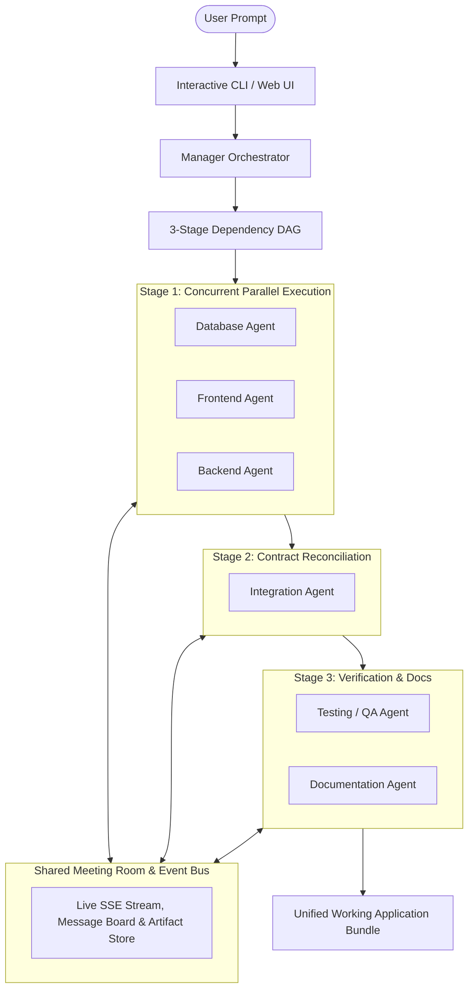

# 🤖 AgentX — Multi-Agent AI Orchestration System

An autonomous, collaborative AI orchestration platform inspired by the Manager-Workers architecture. A user provides a plain-language project idea and receives a complete, working, production-grade application orchestrated concurrently across specialized AI agents.

---

## ⚡ Core Architecture



---

## 👥 Specialized Agent Team

| Agent | Role | Responsibility | Execution Mode |
| :--- | :--- | :--- | :--- |
| 👔 **Manager Agent** | Project Orchestrator | Decomposes goals into DAG, schedules tasks, tracks benchmarks, merges deliverables | Sequential Orchestrator |
| 🗄️ **Database Agent** | Schema Specialist | Designs relational SQL schemas, indexing, and data models | **Parallel (Stage 1)** |
| 🎨 **Frontend Agent** | UI/UX Specialist | Creates modern, glassmorphic HTML5/CSS3/JavaScript components | **Parallel (Stage 1)** |
| ⚡ **Backend Agent** | API Architect | Develops FastAPI REST endpoints, CRUD routes, and CORS middleware | **Parallel (Stage 1)** |
| 🔗 **Integration Agent** | System Integrator | Harmonizes endpoint routes, resolves contract mismatches, wires UI to API | Sequential (Stage 2) |
| 🧪 **Testing Agent** | QA Lead | Generates automated test suites and boundary check harnesses | **Parallel (Stage 3)** |
| 📝 **Documentation Agent** | Technical Writer | Compiles complete README, architecture diagrams, and run guides | **Parallel (Stage 3)** |

---

## 🚀 Quickstart & Usage

### 1. Installation

Ensure Python 3.9+ is installed:
```bash
pip install -r requirements.txt
```

### 2. Configure LLM Provider (Optional)
The platform natively supports **Google Gemini**, OpenAI, Anthropic, Ollama, and a zero-key offline smart synthesizer:
```bash
# For Google Gemini (Recommended):
export GEMINI_API_KEY="your-gemini-api-key"

# Or configure in .env / UI Settings modal
```

### 3. Option A: Run via Interactive CLI
Type any project idea in plain language:
```bash
python cli.py
```

### 4. Option B: Run Automated Proof of Parallelism
Verifies that Frontend and Backend agents launch at the exact same millisecond:
```bash
python demo_parallel.py
```

### 5. Option C: Run Full-Stack Web Platform & Meeting Room
```bash
python start.py
```
Open **[http://localhost:8000](http://localhost:8000)** in your browser to view the live collaborative Meeting Room, code editor, and live app preview.

---

## 📊 Proof of Parallelism (Benchmark Results)

Execution timestamps captured during concurrent generation:

```
--- WORKER EXECUTION TIMELINE & TIMESTAMPS ---
AGENT ROLE             | TYPE           | START TIMESTAMP (UTC)      | DURATION  
──────────────────────────────────────────────────────────────────────────────
DatabaseAgent          | database       | 2026-09-10T22:16:05.385703 | 1.421 s
FrontendAgent          | frontend       | 2026-09-10T22:16:05.669748 | 1.375 s
BackendAgent           | backend        | 2026-09-10T22:16:05.942200 | 1.396 s
IntegrationAgent       | integration    | 2026-09-10T22:16:07.587496 | 1.258 s
TestingAgent           | testing        | 2026-09-10T22:16:09.077771 | 1.270 s
DocumentationAgent     | documentation  | 2026-09-10T22:16:09.333728 | 1.283 s

✅ PARALLELISM CONFIRMED: Frontend & Backend launched concurrently at 2026-09-10T22:16:05
✅ CONCURRENCY SPEEDUP: Total wall-clock time is significantly lower than serialized sum.
```

---

## 📁 Output Artifacts
Every run generates a self-contained, runnable project directory inside `generated_projects/<project_name>/`:
- `index.html` — Modern responsive interface
- `styles.css` — Tailored glassmorphism and modern typography
- `app.js` — Client state reactive store and REST client
- `server.py` — Complete FastAPI backend with SQLite persistence
- `schema.sql` — Relational table schema and indices
- `test_suite.js` / `test_suite.py` — Automated verification tests
- `README.md` — Project run instructions and agent contribution table
- `multi_agent_metrics.json` — Microsecond timestamp logs and performance proof
